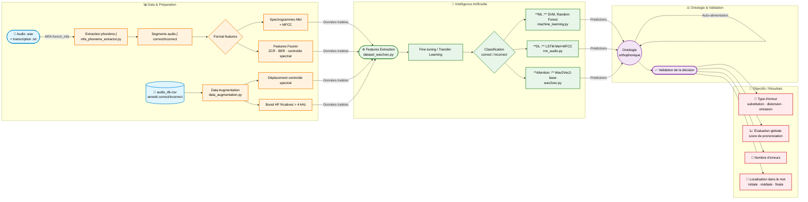

# Datathon 2026 - Back2Speak

## Introduction

Fort de l'expérience passée avec Back2smilE nous souhaitons avec Back2speaK aborder un nouveau champ de compétence par l'analyse sonore. En France, les troubles de l'articulation concernent entre 5 et 8% des enfants d'âge scolaire selon l'Assurance Maladie. Cette prévalence varie selon l'âge : elle atteint 15% chez les enfants de 3 ans, puis diminue progressivement pour se stabiliser autour de 2-3% à l'adolescence. Les cabinets d'orthophonie sont sur liste d'attente il faut en moyenne 8 à 24 mois (ou plus)pour une prise en charge, les séances sont proposées à une fréquence de 1/7 ce qui est peu pour automatiser un geste articulatoire correct. La répétition quotidienne permettrait d'ancrer le geste plus efficacement et plus rapidement. Nous cherchons à développer un outil de rééducation capable de détecter les déficits phonétiques et de proposer aux patients des exercices à domicile, qui s'adaptent aux besoins, prodiguent des conseils et des exercices efficaces et qui évoluent en fonction des progrès.

## Cible phonétique : le son « ch » (ʃ) en français

Le premier phonème ciblé est la consonne fricative palatale **ʃ** (comme dans *chat*, *chien*, *choix*). C'est l'une des erreurs les plus fréquentes chez les enfants présentant des troubles articulatoires : ils la substituent souvent par [s] (sigmatisme) ou l'omettent. La reconnaissance automatique de ce phonème constitue la brique de base du pipeline avant d'étendre à d'autres phonèmes.

**Tâche :** étant donné un enregistrement audio d'un enfant prononçant un mot ou une phrase contenant « ch », le système doit :
1. **Localiser** automatiquement le segment ʃ via Montreal Forced Aligner (`french_mfa`)
2. **Extraire** les features acoustiques pertinentes pour les fricatives (énergie haute fréquence > 4 kHz, centroïde spectral, MFCC, spectrogramme Mel)
3. **Classifier** le phonème : `correct` ou `incorrect` (et à terme : type d'erreur — substitution, distorsion, omission)
4. **Restituer** un feedback adapté au patient

## Structure du code

| Dossier / Fichier | Rôle |
|---|---|
| `pre_processing/mfa_phoneme_extractor.py` | Pipeline MFA complet : aligne audio + transcription, génère TextGrids, extrait les segments ʃ en `.wav` |
| `pre_processing/audio_extractor.py` | Extraction de phonèmes/mots depuis un TextGrid existant (`pydub`, `tgt`) |
| `pre_processing/data_augmentation.py` | Augmentation spectrale : déplacement du centroïde et boost des HF fricatives, génère N variantes par fichier |
| `pre_processing/csv_database_extractor.py` | Mise en forme du CSV de la base de données |
| `model/dataset_wav2vec.py` | Chargement du dataset structuré par classe → `DatasetDict` HuggingFace, audio 16 kHz |
| `model/wav2vec.py` | Fine-tuning `facebook/wav2vec2-base` (TF/Keras) pour classification audio |
| `model/rnn_audio.py` | LSTM sur features Mel-spectrogramme + MFCC (PyTorch) |
| `model/machine_learning.py` | Extraction de features classiques (`librosa`) pour SVM / Random Forest |
| `audio_db.csv` | Base annotée : `audio_id`, `speaker`, `age`, `sexe`, `position`, `type_item` (isolé/syllabe/mot/phrase), `decision` (correct/incorrect) |

**Blocs à connecter (pipeline non encore câblé) :**
- `mfa_phoneme_extractor.py` → segments `.wav` ʃ → `dataset_wav2vec.py` ou loader LSTM
- `data_augmentation.py` → enrichissement du split `train/` avant entraînement
- Sorties des modèles → ontologie orthophonique (à implémenter) → résultats structurés

## Comment on fait

[Exemple de données public](https://lbourdois.github.io/blog/audio/dataset_audio_fr/)
